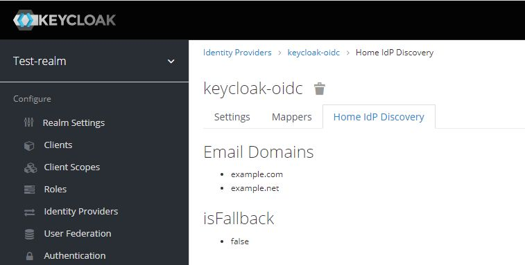

# Keycloak: Home IdP Discovery

This is a simple Keycloak authenticator to redirect users to their home identity provider during login.


## What is it good for?

When a federated user wants to login via Keycloak, Keycloak will present a username/password form and a list of configured identity providers to the user. The user needs to choose an identity provider to get redirected.
This authenticator allows to skip the step of selecting an identity provider.

## How does it work?

If this authenticator gets configured as part of a browser based login flow, Keycloak will present a username form (without password form and without list of configured identity providers).
A user can then enter an email address. Keycloak will then choose an identity provider based on the provided email domain and forward the user to the chosen provider.

## How to install?

Download a release (*.jar file) that works with your Keycloak version from the [list of releases](https://github.com/sventorben/keycloak-home-idp-discovery/releases).

### Server
Copy the jar to the `providers` folder and execute the following command:

```shell
${kc.home.dir}/bin/kc.sh build
```

### Container image (Docker)
For Docker-based setups mount or copy the jar to `/opt/keycloak/providers`.

You may want to check [docker-compose.yml](docker-compose.yml) as an example.

### Maven/Gradle

Packages are being released to GitHub Packages. You find the coordinates [here](https://github.com/sventorben/keycloak-home-idp-discovery/packages/1112199/versions)!

It may happen that I remove older packages without prior notice, because the storage is limited on the free tier.


## How to configure?

### Add Authenticator Execution

* Navigate to `Authentication`
* Create a custom `Basic` flow
* Click `Add execution`
* Select `Home IdP Discovery` and add the execution
* Set execution as required or alternative as desired
* Bind your newly created flow as desired - either as a default for the whole realm or on a per-client basis.

See the image below for an example:


### Configuration options

To configure click settings/gear icon (&#9881;)


| Option                | Description                                                                                                                                                                                                                                                                                                                                                                                                                                                                                             |
|-----------------------|---------------------------------------------------------------------------------------------------------------------------------------------------------------------------------------------------------------------------------------------------------------------------------------------------------------------------------------------------------------------------------------------------------------------------------------------------------------------------------------------------------|
| Forward to linked IdP | If switched on, federated users (with already linked IdPs) will be forwarded to a linked IdP even if no IdP has been configured for the user's email address. Federated users can also use their local username for login instead of their email address.<br><br> If switched off, users will only be forwarded to IdPs with matching email domains.                                                                                                                                                    |
| User attribute        | The user attribute used to lookup the user's email address.<br><br>If set to `email` the authenticator will use the default email property. In this case the authenticator will only forward the user if the email has been verified. For any other attribute, the authenticator will not validate if the email has been verified. <br><br> A common use case is to store a User Principal Name (UPN) in a custom attribute and forward users based on the UPN instead instead of their email address.  |

### Configure email domains

Email domains can be configured per identity provider. Currently, this can only be achieved via [Identity Providers REST API](https://www.keycloak.org/docs-api/19.0/rest-api/index.html#_identity_providers_resource). Make sure to post the full body, as you may receive from a `GET` request to the same endpoint, plus the `home.idp.discovery.domains` configuration.

```
PUT /{realm}/identity-provider/instances/{alias}
{
  ...
  "config": {
    "home.idp.discovery.domains": "example.com##example.net",
    ...
  },
  ...
}
```

Note that domains need to be separated by two hashtags (`##`).

You can also use the [Admin CLI (kcadm)](https://www.keycloak.org/docs/latest/server_admin/#identity-provider-operations):
```shell
kcadm.sh update identity-provider/instances/{alias} -s 'config."home.idp.discovery.domains"="example.com##example.net"'
```

#### Multiple authenticator instances
If you use multiple authenticator instances each using a different user attribute, you can specify different domains per user attribute as well.
For this to work, simply add a config key `home.idp.discovery.domains.<attribute_name>` where `<attribute_name>` is the name of the attribute you are using.

For example, when using a custom user attribute named `upn`, add a key named `home.idp.discovery.domains.upn`.
The authenticator will try to look up the specific key `home.idp.discovery.domains.<attribute_name>` first and fallback to `home.idp.discovery.domains` if the specific key does not exist.

```
PUT /{realm}/identity-provider/instances/{alias}
{
  ...
  "config": {
    "home.idp.discovery.domains": "example.com##example.net",
    "home.idp.discovery.domains.upn": "enterprise.local",
    "home.idp.discovery.domains.email": "example.org",
    ...
  },
  ...
}
```

In the example above, the following domains will be effective when using the configured attribute name:

| configured attribute name | effective domains        |
|---------------------------|--------------------------|
| email                     | example.org              |
| upn                       | enterprise.local         |
| notconfigured             | example.com, example.net |

Please note that the lookup is case-insensitive, so `email` will be the same as `Email` or `EMAIL`.

## Show configured email domains in Admin console

:warning: Please note that this currently only works with the old admin console. Please see https://github.com/sventorben/keycloak-home-idp-discovery/issues/86 for details.

* Open `master` realm
* Navigate to `Realm Settings`
* Click `Themes` tab
* Choose `home-idp-discovery` for the `Admin Console Theme`
* Click `Save`
* Reload the admin console (press F5 in your browser)
* Navigate to an identity provider
* Click `Home IdP Discovery` tab



## Frequently asked questions

### Does it work with the legacy Wildfly-based Keycloak distro?
Maybe! There is even a high chance it will, since this extension does not make use of any Quarkus-related functionality.
For installation instructions, please refer to an [older version of this readme](https://github.com/sventorben/keycloak-home-idp-discovery/blob/v16.0.0/README.md).

Please note that with the release of Keycloak 20.0.0 the Wildfly-based distro is no longer supported.
Hence, I dropped support for the Wildfly-based distro already. Though this library may still work with the Wildfly-based distro, I will no longer put any efforts into keeping this extension compatible.

### Does it work with Keycloak version X.Y.Z?

If you are using Keycloak version `X` (e.g. `X.y.z`), version `X.b.c` should be compatible.
Keycloak SPIs are quite stable. So, there is a high chance this authenticator will work with other versions, too. Check the details of latest [build results](https://github.com/sventorben/keycloak-home-idp-discovery/actions/workflows/buildAndTest.yml) for an overview or simply give it a try.

Authenticator version `X.b.c` is compiled against Keycloak version `X.y.z`. For example, version `16.3.1` will be compiled against Keycloak version `16.y.z`.

I do not guarantee what version `a.b` or `y.z` will be. Neither do I backport features to older version, nor maintain any older versions of this authenticator. If you need the latest features or bugfixes for an older version, please fork this project or update your Keycloak instance. I recommend doing the latter on regular basis anyways.
