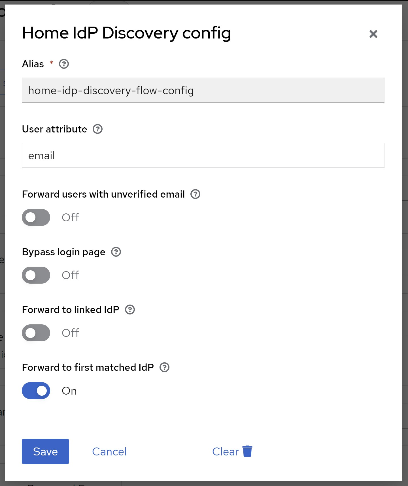

# Configuration
{: .no_toc }

## Table of contents
{: .no_toc .text-delta }

1. TOC
{:toc}

---

## Authenticator execution

First, you have to add an authenticator execution to your login flow.

* Navigate to `Authentication`
* Create a custom `Basic` flow
* Click `Add execution`
* Select `Home IdP Discovery` and add the execution
* Set execution as required or alternative as desired
* Bind your newly created flow as desired - either as a default for the whole realm or on a per-client basis.

See the image below for an example:


## General configuration options

To configure click settings/gear icon (&#9881;)



| Option                              | JSON property name       | Type      | Description                                                                                                                                                                                                                                                                                                                                                                                                                                                                                                                                                                                                                                                                                                                                                                  |
|-------------------------------------|--------------------------|-----------|------------------------------------------------------------------------------------------------------------------------------------------------------------------------------------------------------------------------------------------------------------------------------------------------------------------------------------------------------------------------------------------------------------------------------------------------------------------------------------------------------------------------------------------------------------------------------------------------------------------------------------------------------------------------------------------------------------------------------------------------------------------------------|
| User attribute                      | `userAttribute`          | `string`  | The user attribute used to lookup the user's email address.<br><br>If set to `email` (default) the authenticator will use the default email property. In this case the authenticator will only forward the user if the email has been verified or 'Forward users with unverified email' option is enabled. For any other attribute, the authenticator will not validate if the email has been verified. <br><br> A common use case is to store a User Principal Name (UPN) in a custom attribute and forward users based on the UPN instead instead of their email address.                                                                                                                                                                                                  |
| Forward users with unverified email | `forwardUnverifiedEmail` | `boolean` | If switched on (`true`), users with unverified email addresses will be forwarded to their home IdP.<br><br> If switched off (`false`, default), users with unverified email addresses will not be forwarded to their home IdP.                                                                                                                                                                                                                                                                                                                                                                                                                                                                                                                                               |                                                                                                                                                                                                                                                                                                                                                                                                                                                                                                                               |
| Bypass login page                   | `bypassLoginPage`        | `boolean` | If switched on (`true`), users will be forwarded to their home IdP without the need to reenter/confirm their email address on the login page iff email address is provided as an OICD [`login_hint` parameter](https://openid.net/specs/openid-connect-core-1_0.html#AuthRequest) or SAML `subject/nameID`.<br><br> If switched off (`false`, default), users are only redirected after submitting/confirming their email address on the login page.<br> <br> *Note: This will take SAML `ForceAuthn` and OIDC [`prompt=login&#124;consent&#124;select_account`](https://openid.net/specs/openid-connect-core-1_0.html#AuthRequest), and `max_age` parameters into account. If one of these parameters is present, the login page will not be bypassed even if switched on.* |
| Forward to linked IdP               | `forwardToLinkedIdp`     | `boolean` | If switched on (`true`), federated users (with already linked IdPs) will be forwarded to a linked IdP even if no IdP has been configured for the user's email address. Federated users can also use their local username for login instead of their email address.<br><br> If switched off (`false`, default), users will only be forwarded to IdPs with matching email domains.                                                                                                                                                                                                                                                                                                                                                                                             |
| Forward to first matched IdP        | `forwardToFirstMatch`    | `boolean` | If switched on (`true`, default), users will be forwarded to the first IdP that matches the email domain, even if multiply IdPs may match.<br><br>If switched off (`false`), user will be shown all IdPs that match the email domain to choose one, iff multiple match.<br>The user will only be able to choose from IdPs that match the email domain. Please note that also IdPs that have [`Hide on Login Page`](https://www.keycloak.org/docs/latest/server_admin/#_general-idp-config) switched on will be shown.<br>If only one IdP matches, behavior is the same as if switched on.                                                                                                                                                                                    |

## Email domains

Email domains can be configured per identity provider. Currently, this can only be achieved via [Identity Providers REST API](https://www.keycloak.org/docs-api/19.0/rest-api/index.html#_identity_providers_resource). Make sure to post the full body, as you may receive from a `GET` request to the same endpoint, plus the `home.idp.discovery.domains` configuration.

```
PUT /{realm}/identity-provider/instances/{alias}
{
  ...
  "config": {
    "home.idp.discovery.domains": "example.com##example.net",
    ...
  },
  ...
}
```

Note that domains need to be separated by two hashtags (`##`).

You can also use the [Admin CLI (kcadm)](https://www.keycloak.org/docs/latest/server_admin/#identity-provider-operations):
```shell
kcadm.sh update identity-provider/instances/{alias} -s 'config."home.idp.discovery.domains"="example.com##example.net"'
```

### Multiple authenticator instances
If you use multiple authenticator instances each using a different user attribute, you can specify different domains per user attribute as well.
For this to work, simply add a config key `home.idp.discovery.domains.<attribute_name>` where `<attribute_name>` is the name of the attribute you are using.

For example, when using a custom user attribute named `upn`, add a key named `home.idp.discovery.domains.upn`.
The authenticator will try to look up the specific key `home.idp.discovery.domains.<attribute_name>` first and fallback to `home.idp.discovery.domains` if the specific key does not exist.

```
PUT /{realm}/identity-provider/instances/{alias}
{
  ...
  "config": {
    "home.idp.discovery.domains": "example.com##example.net",
    "home.idp.discovery.domains.upn": "enterprise.local",
    "home.idp.discovery.domains.email": "example.org",
    ...
  },
  ...
}
```

In the example above, the following domains will be effective when using the configured attribute name:

| configured attribute name | effective domains        |
|---------------------------|--------------------------|
| email                     | example.org              |
| upn                       | enterprise.local         |
| notconfigured             | example.com, example.net |

Please note that the lookup is case-insensitive, so `email` will be the same as `Email` or `EMAIL`.

### Subdomain matching

If you need to match subdomains, simply add a config key `home.idp.discovery.matchSubdomains.<attribute_name>` where `<attribute_name>` is the
name of the attribute you are using. Valid values are `true` and `false` (default).

```
PUT /{realm}/identity-provider/instances/{alias}
{
  ...
  "config": {
    "home.idp.discovery.domains": "example.com",
    "home.idp.discovery.matchSubdomains": false,
    "home.idp.discovery.domains.upn": "enterprise.local",
    "home.idp.discovery.matchSubdomains.upn": true
    ...
  },
  ...
}
```

In the example above, the following domains will be effective when using the configured attribute name:

| configured attribute name | domain                    | effective | justification                                                                                 |
|---------------------------|---------------------------|-----------|-----------------------------------------------------------------------------------------------|
| email                     | example.com               | yes       | domain not configured for attribute, but fully matches default domain                         |
| email                     | sub.example.com           | no        | domain not configured for attribute and subdomain matching is disabled for default domains    |
| email                     | enterprise.local          | no        | domain not configured as default domain or attribute                                          |
| email                     | sub.enterprise.local      | no        | domain not configured as default domain or attribute                                          |
| upn                       | example.com               | no        | domain not configured for attribute                                                           |
| upn                       | sub.example.com           | no        | domain not coinfigured for attribute                                                          |
| upn                       | enterprise.local          | yes       | domain configured for attribute and fully matches configured domain                           |
| upn                       | sub.enterprise.local      | yes       | subdomain matching is enabled for attribute and and domain is subdomain of configured domains |
| upn                       | deep.sub.enterprise.local | yes       | subdomain matching is enabled for attribute and and domain is subdomain of configured domains |
| upn                       | someenterprise.local      | no        | domain not coinfigured for attribute (suffix is identical, but it is not a subdomain          |
