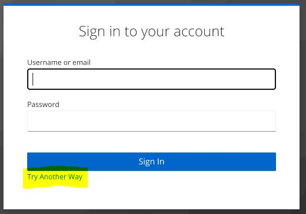
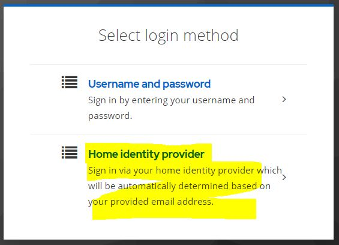
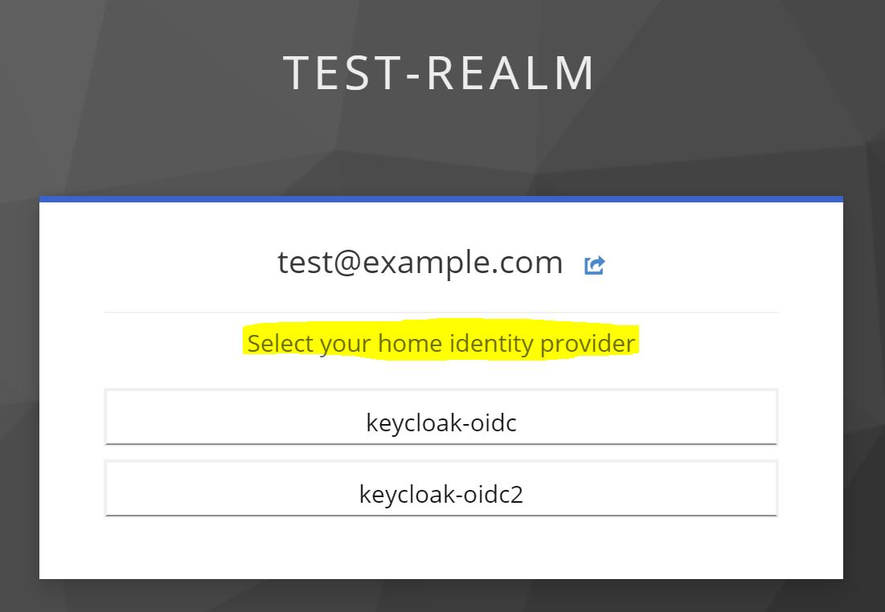

# Theme support
{: .no_toc }

## Table of contents
{: .no_toc .text-delta }

1. TOC
{:toc}

---

The authenticator supports internationalization and you can add additional languages or locales as needed.

Please see the [Server Developer guide](https://www.keycloak.org/docs/latest/server_development/#messages) for detailed information.

### Customized messages for select login options dialog
When you configured this authenticator as an alternative to other authenticators, Keycloak may show a link "Try Another Way" during login as shown below:



When clicking that link, the user can select the login method based on configured alternative authenticators.



You can change the title and help text for this authenticator by adding the following messages to your custom theme:

```properties
home-idp-discovery-display-name=Home identity provider
home-idp-discovery-help-text=Sign in via your home identity provider which will be automatically determined based on your provided email address.
```

### Customized messages for selecting an IdP during login
If multiple IdPs match the email domain of the user, the user may be presented with a dialog to choose an identity provider (see config option `Forward to first matched IdP`).



You can change the title by adding the following messages to your custom theme:

```properties
home-idp-discovery-identity-provider-login-label=Select your home identity provider
```
